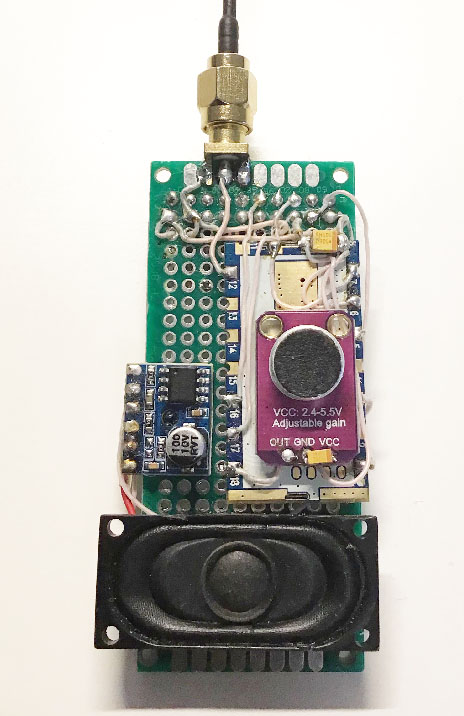
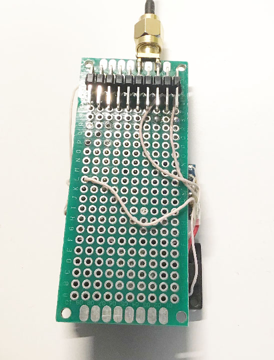
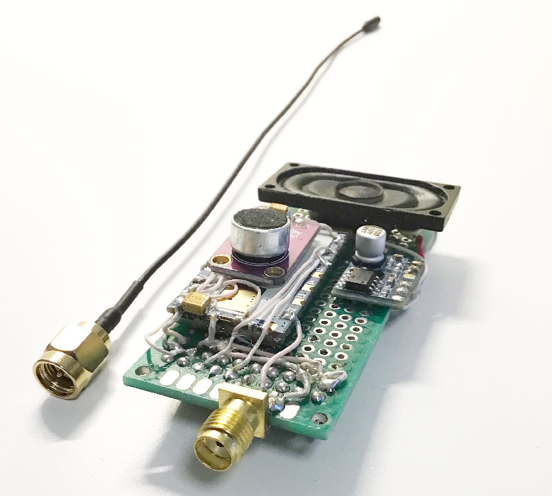

# ESPboy Walkie-Talkie module

[Demo video](https://youtu.be/v-oIQ5hdZ3Q)

The ESPboy Walkie-Talkie module uses SA868 transceiver allows you to use your ESPboy as an Walkie-Talkie radio.
You can buy this module ready-made or make it yourself.

## 1. Buy parts

1.1
[SA868 module](https://aliexpress.ru/wholesale?SearchText=SA868)

[datasheet](https://datasheet.lcsc.com/lcsc/2204251600_G-NiceRF-SA868-U_C3001507.pdf)

1.2
[LTK5128 amplifier board](https://aliexpress.ru/wholesale?SearchText=LTK5128+amplifier+board)

[datasheet](http://www.datasheetcafe.com/ltk5128-datasheet-audio-power-amplifier-chip/?ysclid=lcg57dtr1s522639722)

1.3
[MAX9814 microphone (i used one with manual gain adjustment)](https://aliexpress.ru/wholesale?SearchText=MAX9814+microphone&g=y&page=2)

[datasheet](https://datasheetspdf.com/pdf/644179/MaximIntegratedProducts/MAX9814/1)

1.4
[speaker 4Ohm 3w (i used speaker from the old notebook)](https://aliexpress.ru/wholesale?SearchText=speaker+4Ohm+3w&g=y&page=3)

1.5
[antenna connector](https://aliexpress.ru/wholesale?SearchText=sma+connector)

1.6
[antenna](https://aliexpress.ru/wholesale?SearchText=antenna+UHF)

**NOTES:
- take into account connectors to fit one to other (antenna connector on the board and antenna connector on the antenna itself)
- take into account the length of the antenna, the optimal length (for the best perfomance/range) should be 
1xY; 1/2xY; 1/4xY; 1/8xY where Y = 300/Frequency (longer antenna - better signal).

example: Let it be working frequency 433mhz. Antenna length = (300/433)x(1/4) = 0,173m = 17,3sm

## 2. Connect them to the ESPboy

Connections SA868 module:

SA868 1 (Audio ON) -> ESPboy B6, LTK5128board Mute

SA868 3 (Audio output) -> LTK5128board Audio_Input

SA868 5 (PTT) -> ESPboy B7 

SA868 6 (PD/PowerDown) -> ESPboy VCC

SA868 7 (High/Low power) -> SA868 10 for LowPower or keep opened to HighPower (do NOT connect to VCC!)

SA868 8 (VBAT) -> ESPboy VCC

SA868 9 (GND) -> ESPboy GND

SA868 10 (GND) -> ESPboy GND

SA868 12 (ANT) -> antenna central wire (do not forget to solder ground antenna wire to GND)

SA868 16 (RXD) -> ESPboy SS (GPIO15/D8)

SA868 17 (TXD) -> ESPboy MI (GPIO12/D6)

SA868 18 (MIC) -> MAX9814 OUT

**NOTES:
- connect ESPboy VSS and ESPboy GND to MAX9814board (VCC and GND) and LTK5128board (Power +5v and ASND)
- connect antenna ground wire to ESPboy GND
- connect speaker to LTK5128 amplifier board "Audio output +" and "Audio output -"
- connect antenna itself  

## 3. Upload this firmware

**NOTE: Before compilation, set Arduino IDE settings
-  Board:  ESP8266 WeMos D1 mini
-  CPU frequency: 160Mhz

## 4. Have fun and check useful links

- [Buy ESPboy](https://www.tindie.com/products/23910/)
- [DIY ESPboy](https://easyeda.com/ESPboy)
- [Main Web site](https://www.espboy.com)
- [YouTube channel](https://www.youtube.com/c/ESPboy)
- [Community](https://community.espboy.com)
- [Discord chat](https://discord.gg/kXfDQpX)
- [Twitter](https://twitter.com/ESPboy_edu)
- [Software](https://github.com/ESPboy-edu)
- [Contact: espboy.edu@gmail.com](mailto:espboy.edu@gmail.com)

